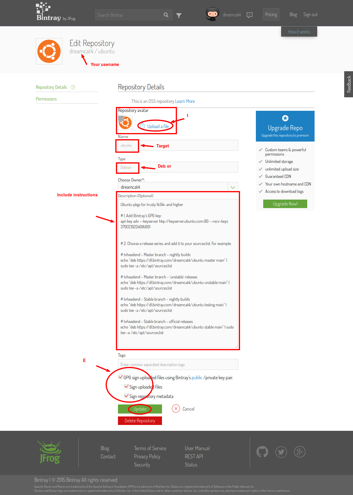
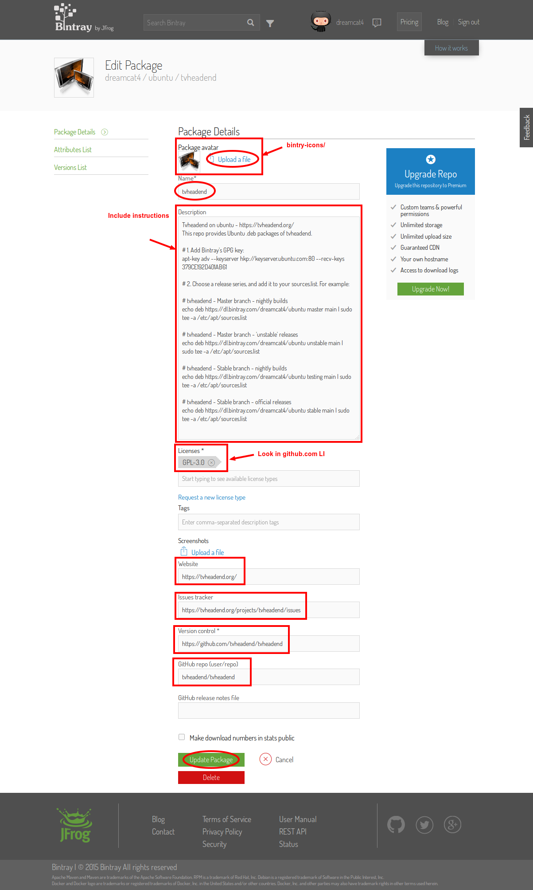

**[`Main Page`](0. maintainers-guide.md)** / **`Step 1`** / **[`Step 2`](2. create-tvh.ubuntu.build.deps.md)** / **[`Step 3`](3. create-private-bitbucket-repo.md)** / **[`Step 4`](4. create-private-docker-images.md)**

## Step 1 - create bintray repo and package

This step in the setup is pretty simple. It can all be done in a regular web browser, on your account pages at the bintray website.

<!-- START doctoc generated TOC please keep comment here to allow auto update -->
<!-- DON'T EDIT THIS SECTION, INSTEAD RE-RUN doctoc TO UPDATE -->
 

- [Overview](#overview)
- [Create bintray repo for ubuntu APT repository](#create-bintray-repo-for-ubuntu-apt-repository)
- [Create bintray package for tvheadend](#create-bintray-package-for-tvheadend)

<!-- END doctoc generated TOC please keep comment here to allow auto update -->

### Overview

* Create bintray repo and package for tvheadend
  * This is where the builder (a docker image) will upload our .deb packages to
* On bintray.com
  * Create a new Debian repo, named: `ubuntu`
    * Copy all the same settings from https://bintray.com/dreamcat4/ubuntu
  * Create a new package named `tvheadend`
    * Copy all the settings from https://bintray.com/dreamcat4/ubuntu/tvheadend

### Create bintray repo for ubuntu APT repository

* On bintray.com
  * Create a new Debian repo, named: `ubuntu`
    * Copy all the same settings from https://bintray.com/dreamcat4/ubuntu

### Create bintray package for tvheadend

  * In the new debian repo, named: `ubuntu`
    * Create a new 'tvheadend' package
      * Copy all the settings from https://bintray.com/dreamcat4/ubuntu/tvheadend

Done.

Now you should have the location on bintray where we can upload a new "version" of tvheadend to. A bintray "version" is a complete set of the distribution files. e.g. everything that is build from 1 specific git commit.

The 'version' is what our builder image will automatically create each time, and upload the new files to. Those instructions are `curl` api requests in the helper script [`upload-to-bintray`](https://github.com/tvheadend/tvheadend-build/blob/master/ubuntu/master/upload-to-bintray).

