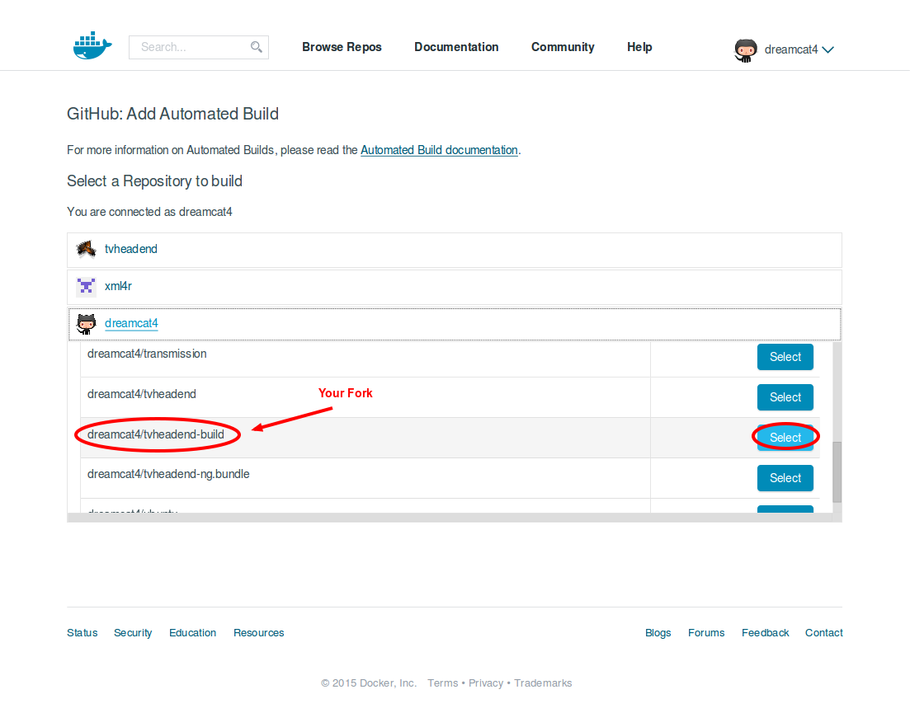
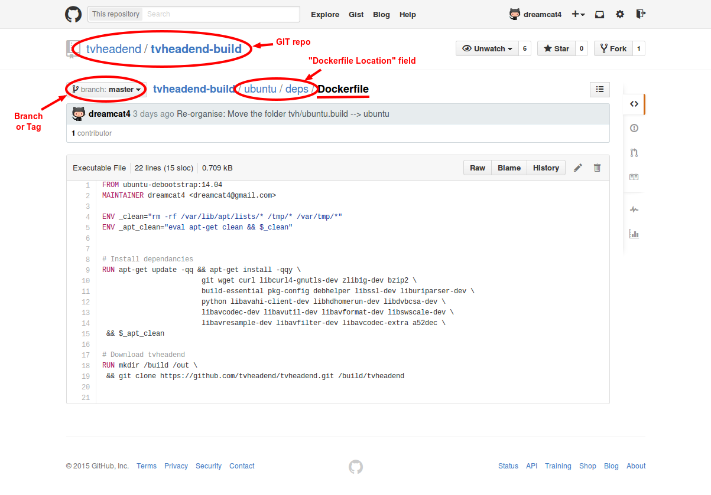
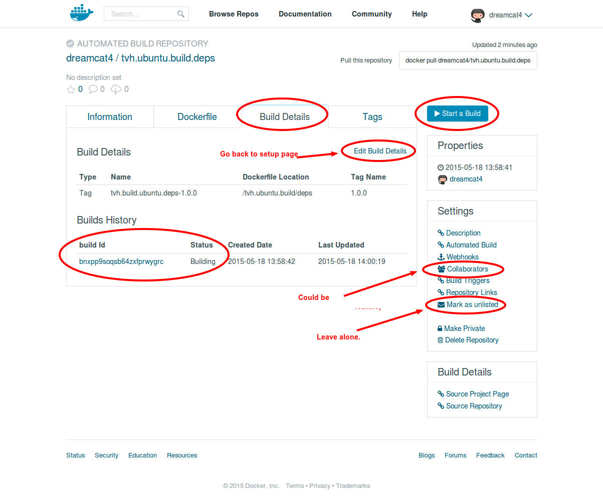
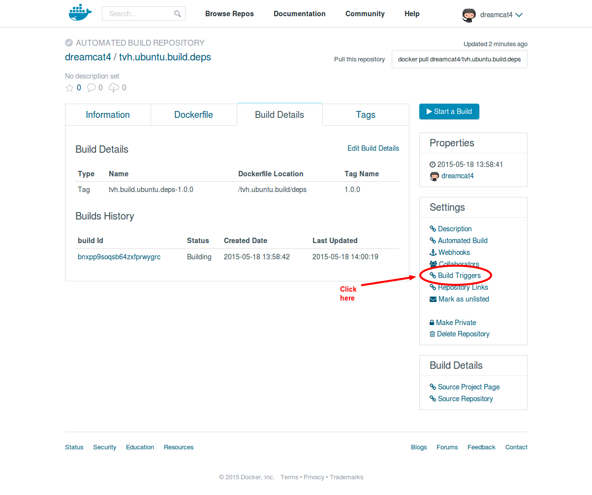

**[`Main Page`](0. maintainers-guide.md)** / **[`Step 1`](1. create-bintray-repo-and-package.md)** / **[`Step 2`](2. create-tvh.ubuntu.build.deps.md)** / **[`Step 3`](3. create-private-bitbucket-repo.md)** / **[`Step 4`](4. create-private-docker-images.md)**

## Step 2 - build `tvh.ubuntu.build.deps`

This step is optional.

As things stand, we just use `FROM dreamcat4/tvh.ubuntu.build.deps` as the first line in the `Dockerfiles` of the tvheadend `.deb` builder images. It points to my own dockerhub build of this common base image. The image is public.

We only need to update this docker image (it's `Dockerfile`) very infrequently. Either to modify the package list in order to add new build dependancies (e.g. newly added HdHomeRun support). Or to remove deprecated or broken ones (e.g. `libiconv`). Or if building for a different distro e.g. Debian, Centos / Fedora etc.

These instructions show how you can build your own version of this image. If you need to build a different set of build dependacies, or modify / update them. You would also update the first line of the `Dockerfiles` with `FROM yourDockerUsername/tvh.ubuntu.build.deps`

<!-- START doctoc generated TOC please keep comment here to allow auto update -->
<!-- DON'T EDIT THIS SECTION, INSTEAD RE-RUN doctoc TO UPDATE -->
 

- [Overview](#overview)
- [Create source repo for Dockerfile](#create-source-repo-for-dockerfile)
- [Create new docker image on dockerhub](#create-new-docker-image-on-dockerhub)
- [Schedule a regular re-build](#schedule-a-regular-re-build)
- [Enable email notification for failed builds](#enable-email-notification-for-failed-builds)

<!-- END doctoc generated TOC please keep comment here to allow auto update -->

### Overview

* Create public docker image of tvheadend's build dependancies
  * On Github
    * Create git repo of build files for the `tvh.ubuntu.build.deps` docker image
  * On Dockerhub
    * Create new public repo named `tvh.ubuntu.build.deps`
      * As automated build
      * Enter your Github Repo - a fork of `tvheadend/tvheadend-build`
      * Enter the folder path to `ubuntu/deps` subfolder
      * Click the `Start Build` Button
      * Enable build trigger
      * Get build trigger api token
  * On developer PC / server machine (via ssh) as regular user
    * Copy `dh-trigger` curl script & trigger token into local folder
    * Manually test that the script triggers a rebuild over on dockerhub
    * Setup cron job to automatically re-build deps image once a week

### Create source repo for Dockerfile

* Login to Github
  * Fork the build files of the `tvh.ubuntu.build.deps` docker image
  * Go to https://github.com/tvheadend/tvheadend-build and click the 'Fork' button.
  * Copy the entire subfolder named `ubuntu/` in your own repo, or rename it.
  * Edit the file `/ubuntu/deps/Dockerfile` to update the build dependancies.
  * Done.

### Create new docker image on dockerhub

* Login to Dockerhub
  * Create new public repo named `tvh.ubuntu.build.deps`
    * As an automated build


* Selected the forked Github Repo where the new `ubuntu/deps/Dockerfile` now exists. e.g. `yourGithubUsername/tvheadend-build`



* Now enter the details of the build.
  * Most important - set the repo's subfolder path to the Dockerfile. e.g. `ubuntu/deps`
  * Other fields are optional, depending if you have git-tagged the version, etc.
  * AMMEDMENT - The screenshot below shows a tag name of `1.0.0` - that is incorrect. The docker tag (rightmost column should be left as `latest`, which is the default value.


  * Double check the Github repo from earlier for right `Dockerfile` location:



* The initial build should start automatically.
* Else just press the `Start Build` Button.



### Schedule a regular re-build

We do not need to rebuild the apt dependancies as often as tvheadend itself. Just once in a while, for example if ubuntu's ffmpeg version gets updated etc. I recommend a once-weekly build trigger.

We do this by setting up a small cron job on our local (developer) PC. Or any secure server that you have `ssh` login access to. Our cron script must be `chmod 700` as it contains in plaintext our Dockerhub API key. Which is needed for `curl`ing the build trigger rest api (it's just a webhook, like github webooks etc.)

* First we need to enable the build trigger in the dockerhub build setup:




* Now that we know the value for `$trigger_token`, we can log into our development PC or other always-connected server (as a regular user). To set up our cron job that triggers the rebuild every week.

* Install the [`dh-trigger`](https://github.com/dreamcat4/dh-trigger) cmd:

```sh
# Choose a location on your $PATH where to save the 'dh-trigger' script
mkdir -p $HOME/.bin

# Download the dh-trigger cmd with wget or curl
wget -O $HOME/.bin/dh-trigger https://raw.githubusercontent.com/dreamcat4/dh-trigger/master/dh-trigger || \
curl https://raw.githubusercontent.com/dreamcat4/dh-trigger/master/dh-trigger -o $HOME/.bin/dh-trigger

# Make executable
chmod +x $HOME/.bin/dh-trigger

# Add the bin/ folder to your $PATH if not already
echo "PATH=\"\$PATH:$HOME/.bin\"" >> ~/.profile
echo "PATH=\"\$PATH:$HOME/.bin\"" >> ~/.bashrc
```

* Get your trigger token from dockerhub config pages ('build triggers' link). Then add it like this:

```sh
# Put here your REAL build trigger key, and write it to file
trigger_token="YOUR-IMAGE's-TRIGGER-TOKEN"

# Save your trigger key to a chmod 600 file in the ~/.dh-trigger/ folder
dh-trigger add "dreamcat4/tvh.ubuntu.build.deps" "$trigger_token"
```

* Manually test that the build trigger works. Run this command & go check the dockerhub 'Build details' page:

```sh
dh-trigger all dreamcat4/tvh.ubuntu.build.deps
```

* Create a cron job for this specific trigger:

We need to specify 2 similar cron lines because of a technical issue regarding daylight savings time.

```sh
# Add a new cron job line to fire off your chosen trigger command
crontab -e    # or 'cru' on some machines
>>>
# tvheadend dependancies - Rebuild 1x per week at 00:15am UTC every monday morning
15 00 * * mon [ "$(date +%z)" = "+0000" ] && $HOME/.bin/dh-trigger all dreamcat4/tvh.ubuntu.build.deps
15 01 * * mon [ "$(date +%z)" = "+0100" ] && $HOME/.bin/dh-trigger all dreamcat4/tvh.ubuntu.build.deps
<<<
```

The trigger command `all` will trigger all the `tags` (branches) of your repo simultaneously. However you may not wish for every one of them to be re-build every time. Then use one of the other trigger commands `dh-trigger --help` for more information.

*It is necessary to make 2 cron lines for each command, as is shown above. To ensure the job will always execute on `UTC` time, irrespective of the 1 hour seasonal shift of your local daylight savings time. This is because even between machines within the same timezone, their can be a number of days when their local offsets are out of sync. Specifically, when one or more of those systems are based on busybox or ulibc. Then the seasonal change date has always been hardcoded and is never guaranteed to be consistent.*

***2nd example:***

If your regular time is `+0500` shift of `UTC`, and your seasonal time is `+0600` shift of `UTC`. Then add `+5` to all of the hours specified in above example. This means being run at `05:15am` and `06:15am` of your local time respectively. So your modified cron lines would then look like this:

```sh
# Add a new cron job line to fire off your chosen trigger command
crontab -e    # or 'cru' on some machines
>>>
# tvheadend dependancies - Rebuild 1x per week at 00:15am UTC every monday morning
15 05 * * mon [ "$(date +%z)" = "+0500" ] && $HOME/.bin/dh-trigger all dreamcat4/tvh.ubuntu.build.deps
15 06 * * mon [ "$(date +%z)" = "+0600" ] && $HOME/.bin/dh-trigger all dreamcat4/tvh.ubuntu.build.deps
<<<
```

***Cron job redundancy:***

But what if your computer does down or has technical problems? Then the scheduled build job will fail to get triggered.

Well since we have solved the time zone problem, we can just repeat the same steps above on other machines. And the same set of cron job(s) will trigger at the same times. Dockerhub will ignore any duplicate build requests. *So long as they are all made within the same 5 minute window. Therefore, in addition to the timezone fix, be sure also that the system time on every machine is being kept in sync with ntpd. Otherwise there is likely to be a significant amount of clock drift.*

### Enable email notification for failed builds

* On dockerhub
  * Go to: https://registry.hub.docker.com/account/notifications/
    * Enable the checkbox:
      * "Notify me when an automated build fails"


