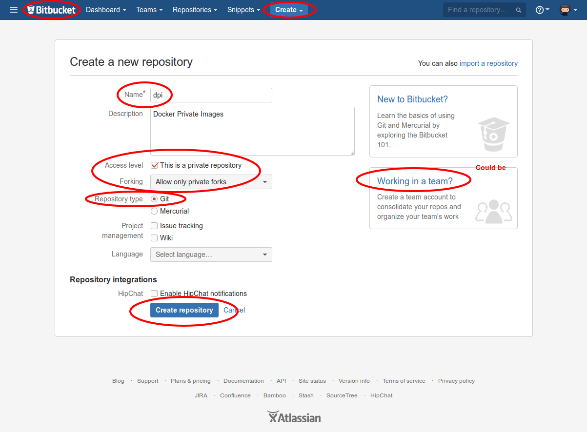

**[`Main Page`](0. maintainers-guide.md)** / **[`Step 1`](1. create-bintray-repo-and-package.md)** / **[`Step 2`](2. create-tvh.ubuntu.build.deps.md)** / **`Step 3`** / **[`Step 4`](4. create-private-docker-images.md)**

## Step 3 - create private bitbucket repo

This is where we will put our build scripts including private bintray API key. The bintray api key is needed by our docker image so it can upload the final `.deb` files to Bintray.com at the end of the build run.

<!-- START doctoc generated TOC please keep comment here to allow auto update -->
<!-- DON'T EDIT THIS SECTION, INSTEAD RE-RUN doctoc TO UPDATE -->
 

- [Overview](#overview)
- [Create bitbucket private repo](#create-bitbucket-private-repo)
- [Initialize repo](#initialize-repo)
- [Put bintray API key into private git repo](#put-bintray-api-key-into-private-git-repo)

<!-- END doctoc generated TOC please keep comment here to allow auto update -->

### Overview

* On Bitbucket
  * Create private git repo
    * Call it `dpi` - for 'Dockerhub private images'
* Initialize repo
  * Copy over the `ubuntu/` folder from public repo
* In local working copy of your `dpi` bitbucket private repo
  * Put your bintray usernname and API key into the file `bintray-env` of each build folder
  * Push changes up to bitbucket

### Create bitbucket private repo

* On Bitbucket
  * Create private git repo
    * Call it `dpi` - for 'Dockerhub private images'



### Initialize repo

* Initialize the repository

```sh
cd ~/
mkdir dpi && cd dpi
git init
git remote add origin git@bitbucket.org:yourBitBucketUsername/dpi.git
```

* Copy over `tvh/ubuntu.build` folder from public repo

```sh
cd ~/
git clone https://github.com/tvheadend/tvheadend-build
cp -Rf tvheadend-build/ubuntu dpi/
```

### Put bintray API key into private git repo

* In local working copy of your `dpi` bitbucket private repo
  * Put your bintray usernname and API key into the file `bintray-env` of each build folder
    * Open `dpi/ubuntu/master/bintray-env` and replace bintray account variables with the values from your own bintray account:

```Dockerfile
bintray_user="dreamcat4"
bintray_key="0123456789abcdef0123456789abcdef01234567"
```

  * Repeat the previous step for each of the 4 build folders: `master`, `unstable`, `testing` and `stable`.


  * Push changes up to bitbucket

```sh
# First make sure you have ssh key setup in bitbucket

# git commit new files
git add .
git commit -a -m "Commit msg"

# For first git push you must specify 'origin master'
git push origin master
```

